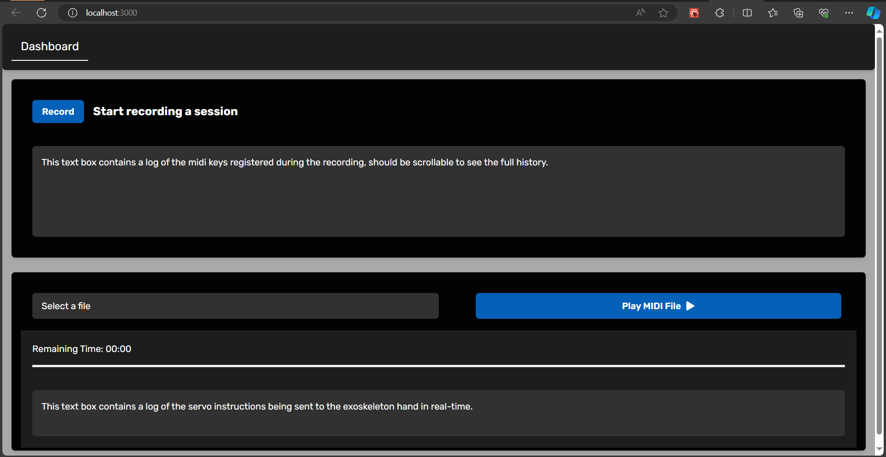
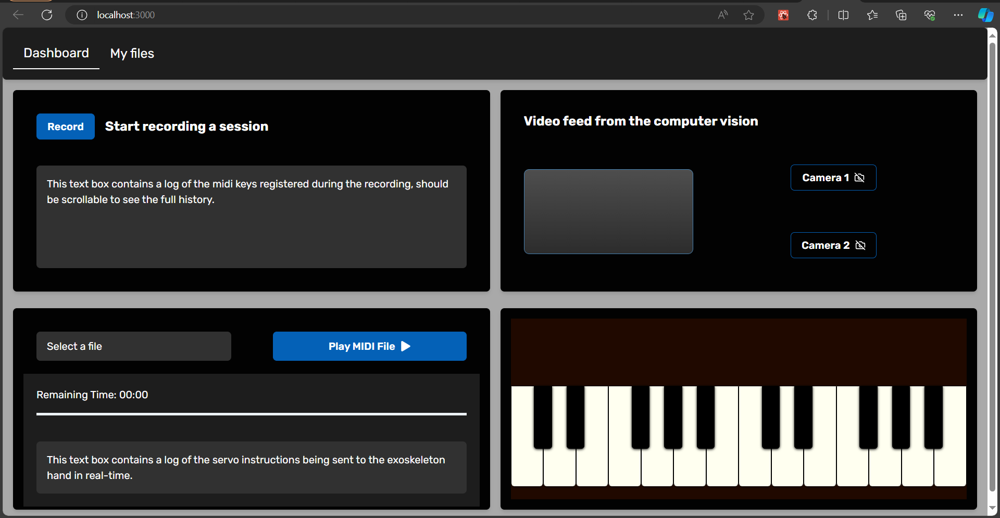
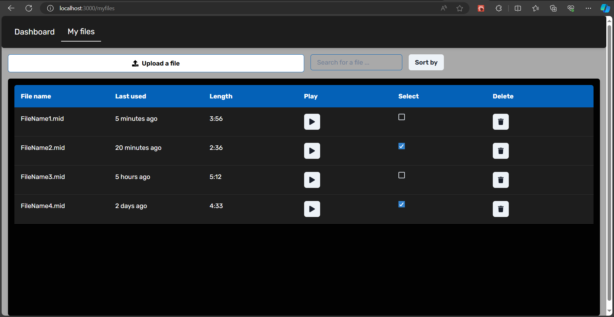

# 2024sp-exoskeleton
<a name="readme-top"></a>

<!-- PROJECT SHIELDS -->
<!--
-->
[![Contributors][contributors-shield]][contributors-url]
[![MIT License][license-shield]][license-url]

<!-- MARKDOWN LINKS & IMAGES -->
<!-- https://www.markdownguide.org/basic-syntax/#reference-style-links -->
<!-- change the contributors page -->

<!-- TABLE OF CONTENTS -->
<details>
  <summary>Table of Contents</summary>
  <ol>
    <li>
      <a href="#about-the-project">About The Project</a>
      <ul>
        <li><a href="#built-with">Built With</a></li>
        <li><a href="#motivation">Motivation</a></li>
        <li><a href="#goal">Goal</a></li>
        <li><a href="#final-result">Final Result</a></li>
      </ul>
    </li>
    <li>
      <a href="#getting-started">Getting Started</a>
      <ul>
        <li><a href="#prerequisites">Prerequisites</a></li>
        <li><a href="#installation">Installation</a></li>
      </ul>
    </li>
    <li>
      <a href="#building-the-exoskeleton">Building the Exoskeleton</a>
      <ul>
        <li><a href="#mechanical-part">Mechanical Part</a></li>
        <li><a href="#electronics">Electronics</a></li>
      </ul>
    </li>
    <li><a href="#software">Software</a></li>
    <li><a href="#problems">Problems</a></li>
    <li><a href="#possible-improvements--extensions">Possible Improvements & Extensions</a></li>
    <li><a href="#license">License</a></li>
  </ol>
</details>

<!-- ABOUT THE PROJECT -->
## About The Project

<!-- MOTIVATION -->
## Motivation

Nowadays, hand exoskeletons are commonly used for rehabilitation therapy following health accidents such as strokes. Its efficacy in muscle memory training has the potential to be exploited in the fields of music, technology, and rehabilitation therapy.

Our project aims to facilitate muscle memory training of various piano techniques for pianists seeking to strengthen specific muscles and refine pianistic skills with greater efficiency. By using a lightweight hand exoskeleton, we can enforce specific positions at a given rhythm that allows the user to acquire a specific technique more quickly compared to traditional training.

We want the user to be able to input a technique and a specific tempo that they wish to train using an accompanying software tied to the exoskeleton. This then allows the exoskeleton to reproduce the movements of the technique.

<p align="right">(<a href="#readme-top">back to top</a>)</p>

<!-- FINAL RESULT -->
### Final Result
At the end of the semester, we have an exoskeleton of a hand that functions as follows:

Some photos for reference:

  


It is controlled via a web application, which includes a feature for playing songs with preloaded files. Additionally, the device can record played pieces, aiding the learning process by allowing users to repeat the segments they prefer.
Each finger is operated by a separate motor, enabling simultaneous movement of all fingers. This design grants the device flexibility, allowing it to play almost any song desired.

<p align="right">(<a href="#readme-top">back to top</a>)</p>

<!-- GETTING STARTED -->
## Getting Started

<p align="right">(<a href="#readme-top">back to top</a>)</p>

<!-- BUILT WITH -->
### Built With 
* [![React][React.js]][React-url]
* [![Python][Python.org]][Python-url]
* [![Cpp][Cpp.org]][Cpp-url]
* [![Flask][Flask.com]][Flask-url]

<p align="right">(<a href="#readme-top">back to top</a>)</p>

<!-- PREREQUISITES -->
### Prerequisites

Comprehensive list of elements we used in our project along with needed equipment. To construct the device, one should
- buy:
  -	Arduino Uno Board
  -	Power supply GST60A12-P1J
  -	Board LM2596
  -	DC Power Jack PJ-102B
  -	4 bowden cables
  -	4 Servo motors DMS15-270
  -	MIDI keyboard
  -	Velcro tape
  -	Sewing kit
  -	Threads
  -	Screws

- have access to:
  -	3D printer with TPU filament
  -	3D printer with PET filament
  -	Laser cutting machine
  -	Plastic board 3mm
  -	MDF board 3mm
  -	Driller
  -	Bunch of different screwdrivers
  -	Soldering kit

<p align="right">(<a href="#readme-top">back to top</a>)</p>

<!-- INSTALLATION -->
### Installation

<p align="right">(<a href="#readme-top">back to top</a>)</p>

<!-- BUILDING THE EXOSKELETON -->
## Building the Exoskeleton

<p align="right">(<a href="#readme-top">back to top</a>)</p>

<!-- MECHANICS -->
### Mechanics

<p align="right">(<a href="#readme-top">back to top</a>)</p>

<!-- ELECTRONICS -->
### Electronics

<p align="right">(<a href="#readme-top">back to top</a>)</p>

<!-- SOFTWARE -->
## Software
We are building a Next.js App. 

We need to have two terminals to run the frontend (client end) and the backend (server end).

### Frontend
The Frontend part is the client of the website.


To run the frontend, please make sure you
```
cd .\frontend\
```
then 
```
npm install
```
then
```
npm run dev
```

If you have encountered the problem of `concurrently "npm run dev:next" "npm run dev:ws"`, please run:
```
npm install concurrently --save-dev
```
then run again
```
npm run dev
```

You will reach the welcome page


Then you can either record a piece which you play and play songs, which are MIDI files.

### Backend
The backend part,

### MIDI Interpreter
The MIDI Interpreter, .

<p align="right">(<a href="#readme-top">back to top</a>)</p>

## Problems

<p align="right">(<a href="#readme-top">back to top</a>)</p>

<!-- POSSIBLE IMPROVEMENTS & EXTENSIONS -->
## Possible Improvements & Extensions

### Hardware

### Software
The front-end web developer has developped the following screens:



In the future, we will develop the Computer Vision part. We have now the fundamental part of Computer Vision which is able to track the hand.
There is also a piano visualizer that will be combined with the MIDI interpreter and the backend.

There is the My_Files page that the front-end and the back-end developers will combine the two ends together. The My_Files page can see the detailed information such as the file name, the last used and the length. We will be able to play, select, deselect and delete the existing MIDI files.

<p align="right">(<a href="#readme-top">back to top</a>)</p>

## License

Distributed under the MIT License. See `LICENSE.txt` for more information.

<p align="right">(<a href="#readme-top">back to top</a>)</p>

<!-- MARKDOWN LINKS & IMAGES -->
<!-- https://www.markdownguide.org/basic-syntax/#reference-style-links -->
[contributors-shield]: https://img.shields.io/badge/CONTRIBUTORS-6-brightgreen?style=for-the-badge 
[contributors-url]: https://github.com/epfl-cs358/2024sp-exoskeleton/graphs/contributors
[license-shield]: https://img.shields.io/badge/LICENSE-MIT-brightyellow?style=for-the-badge
[license-url]: https://github.com/epfl-cs358/2024sp-exoskeleton/blob/main/LICENSE


[React.js]: https://img.shields.io/badge/React-black?logo=react
[React-url]: https://reactjs.org/
[Python.org]: https://img.shields.io/badge/Python-brightgreeen?style=flat&logo=python&logoColor=FFE873&color=306998
[Python-url]: https://www.python.org/
[Flask.com]: https://img.shields.io/badge/Flask-black?style=plastic&logo=flask&color=%2361dafb
[Flask-url]: https://flask.palletsprojects.com/en/3.0.x/
[Cpp.org]: https://img.shields.io/badge/C%2B%2B-blue?logo=cplusplus
[Cpp-url]: https://isocpp.org/
