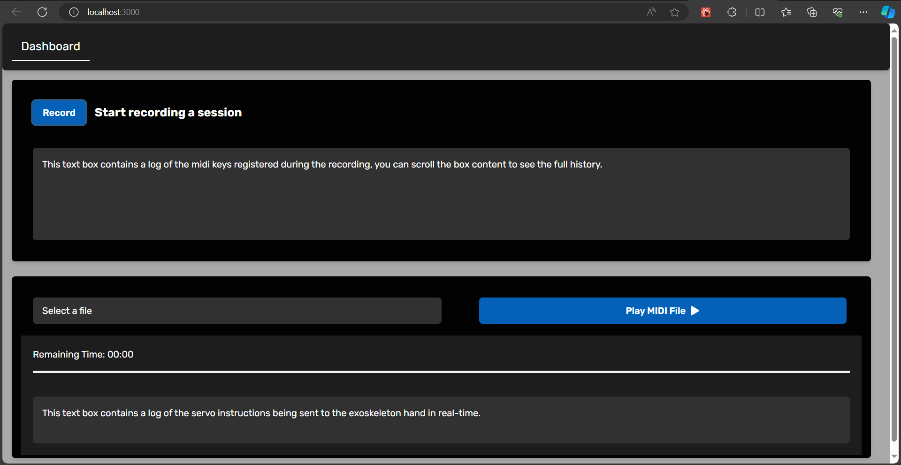

# 2024sp-exoskeleton
<a name="readme-top"></a>

<!-- PROJECT SHIELDS -->
<!--
-->
[![Contributors][contributors-shield]][contributors-url]
[![MIT License][license-shield]][license-url]

### Authors
- [Ewa Miazga](https://github.com/ewaMiazga)
- [Gabin Forestier](https://github.com/ForestDope)
- [Wei-En Hsieh](https://github.com/annhit29)
- [William Robert](https://github.com/AgeX21)
- [Benoit Morawiec](https://github.com/markh0rr)
- [Haris Malik](https://github.com/harismalik-1)


<!-- MARKDOWN LINKS & IMAGES -->
<!-- https://www.markdownguide.org/basic-syntax/#reference-style-links -->
<!-- change the contributors page -->

<!-- TABLE OF CONTENTS -->
<details>
  <summary>Table of Contents</summary>
  <ol>
    <li>
      <a href="#about-the-project">About The Project</a>
      <ul>
        <li><a href="#built-with">Built With</a></li>
        <li><a href="#motivation">Motivation</a></li>
        <li><a href="#goal">Goal</a></li>
        <li><a href="#final-result">Final Result</a></li>
      </ul>
    </li>
    <li>
      <a href="#getting-started">Getting Started</a>
      <ul>
        <li><a href="#prerequisites">Prerequisites</a></li>
        <li><a href="#installation">Installation</a></li>
      </ul>
    </li>
    <li>
      <a href="#building-the-exoskeleton">Building the Exoskeleton</a>
      <ul>
        <li>
          <a href="#mechanical-part">Mechanical Part</a>
          <ul>
          <li><a href="#parts">Parts</a></li>
          <li><a href="#instruction">Instruction</a></li>
          </ul>
        </li>
        <li><a href="#electronics">Electronics</a></li>
      </ul>
    </li>
    <li><a href="#software">Software</a></li>
    <li><a href="#problems">Problems</a></li>
    <li><a href="#possible-improvements--extensions">Possible Improvements & Extensions</a></li>
    <li><a href="#license">License</a></li>
  </ol>
</details>

<!-- ABOUT THE PROJECT -->
## About The Project

<!-- MOTIVATION -->
## Motivation

Nowadays, hand exoskeletons are commonly used for rehabilitation therapy following health accidents such as strokes. Its efficacy in muscle memory training has the potential to be exploited in the fields of music, technology, and rehabilitation therapy.

Our project aims to facilitate muscle memory training of various piano techniques for pianists seeking to strengthen specific muscles and refine pianistic skills with greater efficiency. By using a lightweight hand exoskeleton, we can enforce specific positions at a given rhythm that allows the user to acquire a specific technique more quickly compared to traditional training.

We want the user to be able to input a technique and a specific tempo that they wish to train using an accompanying software tied to the exoskeleton. This then allows the exoskeleton to reproduce the movements of the technique.

<p align="right">(<a href="#readme-top">back to top</a>)</p>

<!-- FINAL RESULT -->
### Final Result
At the end of the semester, we have an exoskeleton of a hand that functions as follows:

Some photos for reference:

<p align="center">
     
     
</p>


It is controlled via a web application, which includes a feature for playing songs with preloaded files. Additionally, the device can record played pieces, aiding the learning process by allowing users to repeat the segments they prefer.
Each finger is operated by a separate motor, enabling simultaneous movement of all fingers. This design grants the device flexibility, allowing it to play almost any song desired.

<p align="right">(<a href="#readme-top">back to top</a>)</p>

<!-- GETTING STARTED -->
## Getting Started

<p align="right">(<a href="#readme-top">back to top</a>)</p>

<!-- BUILT WITH -->
### Built With 
* [![React][React.js]][React-url]
* [![Python][Python.org]][Python-url]
* [![Cpp][Cpp.org]][Cpp-url]
* [![Flask][Flask.com]][Flask-url]

<p align="right">(<a href="#readme-top">back to top</a>)</p>

<!-- PREREQUISITES -->
### Prerequisites

Comprehensive list of elements we used in our project along with needed equipment. To construct the device, one should
- buy:
  -	Arduino Uno Board
  -	Proto Shield ARDUINO V.R3
  -	Power supply GST60A12-P1J
  -	Board LM2596
  -	DC Power Jack PJ-102B
  -	4 bowden cables
  -	4 Servo motors DMS15-270
  -	MIDI keyboard
  -	Velcro tape
  -	Sewing kit
  -	Threads
  -	Screws
  -	Small elastic bands

- have access to:
  -	3D printer with TPU filament
  -	3D printer with PET filament
  -	Laser cutting machine
  -	Plastic board 3mm
  -	MDF board 3mm
  -	Driller
  -	Bunch of different screwdrivers
  -	Soldering kit

<p align="right">(<a href="#readme-top">back to top</a>)</p>

<!-- INSTALLATION -->
### Installation

<p align="right">(<a href="#readme-top">back to top</a>)</p>

<!-- BUILDING THE EXOSKELETON -->
## Building the Exoskeleton

<p align="right">(<a href="#readme-top">back to top</a>)</p>

<!-- MECHANICS -->
### Mechanics

#### Parts
The comprehensive list of all the elements to start:
- [x] 4 adjustable finger wraps
- [x] 4 finger bowden end place holders
- [x] 4 bowden cable guide fingers
- [x] 1 bowden cables guides hand
- [x] 1 bowden cables guides wrist
- [x] 1 forearm top holder
- [x] 1 motors mounting plate
- [x] 1 forearm top holder with cables passthrough
- [x] 1 arduino and power supply bottom plate
- [x] 4 forearm attachments
- [x] 4 bowden cable motor attachments
- [x] 4 bowden inside board holders
- [x] 2 logo sides

To construct the device, one should first print all the necessary elements using 3D printers:

* For 3D printer with PET filament: [STL files](stl_files/pet_3d_print)  
* For 3D printer with TPU filament: [STL files](stl_files/tpu_3d_print)  

Then all the necessary elements need to be laser cut:

* On plastic 3mm board: [DXF files](dxf_files)

#### Instruction
Steps to put the device together:

1. Place threads into holes of Bowden cables guides (hand and wrist)

2. Glue Velcro straps to:
   - a. Bowden cable guides hand
   - b. Bowden cables guides wrist
   - c. 4 forearm attachments

<p align="center">
    
</p>

3. To each of adjustable finger wraps, one should glue:
   - a. Finger bowden end place holders
   - b. Bowden cable guide fingers

<p align="center">
    
</p>

4. Screw motors to the motors mounting plate.

5. Screw logo sides to the motors mounting plate.

<p align="center">
    
</p>

6. Screw 2 forearm attachments to the forearm top holder which has the cables passthrough.

7. Screw 2 forearm attachments to Arduino and power supply bottom plate

<p align="center">
    
</p>

8. Solder all the necessary cables according to the scheme [Scheme]. For more details about soldering, go to section [Electronics](#electronics).

<p align="center">
     
     
</p>

9. Screw the Arduino board with Proto Shield and all soldered components to Arduino and power supply bottom plate.

10. Pass Bowden cables through:
    - a. Bowden cable guides hand
    - b. Bowden cables guides wrist
    - c. Forearm top holder

11. Adjust the length of the Bowden cables in a way they fit to the placement of the motors.

12. Secure the Bowden cables by placing screws in threads of:
    - a. Bowden cable guides hand
    - b. Bowden cables guides wrist

13. Solder a bulb at the end of each of the Bowden cables.

<p align="center">
    
</p>

14. Enclose the soldered bulb in the Bowden cable motor attachments using a screw.

<p align="center">
    
</p>

15. Glue all of Bowden inside board holders in correct places on the forearm top holder

16. Connect Bowden cable motor attachments with Bowden inside board holders using elastic bands. Use the reef knot.

<p align="center">
    
    
</p>

17. Attach Bowden cable motor attachments to the motors, so that they point towards the back (it enables half of the circle rotation to the front, and this push a finger down).

18. Screw the motors mounting plate to the forearm top holder.

<p align="center">
    
</p>

19. Sew Velcro straps to 
    - a. Bowden cable guides hand
    - b. Bowden cables guides wrist
    - c. 2 Bowden forearm attachments (on one of the sides of the Forearm top holder)

<p align="center">
    
</p>

20. Pass the motors’ cables through prepared space on 
    - a. Forearm top holder
    - b. Arduino and power supply bottom plate

<p align="center">
    
</p>

21. Attach the round end of the Bowden cable to the Bowden end place holders and force the cable into the finger guides.

22. Attach the logo at the top of the logo sides.

<p align="center">
    
</p>

<p align="right">(<a href="#readme-top">back to top</a>)</p>


<!-- ELECTRONICS -->
### Electronics

<p align="right">(<a href="#readme-top">back to top</a>)</p>

<!-- SOFTWARE -->
## Software
We are building a Next.js App. 

We need to have two terminals to run the frontend (client end) and the backend (server end).

### Frontend
The Frontend part is the client of the website.


To run the frontend, please make sure you
```
cd .\frontend\
```
then 
```
npm install
```
then
```
npm run dev
```

If you have encountered the problem of `concurrently "npm run dev:next" "npm run dev:ws"`, please run:
```
npm install concurrently --save-dev
```
then run again
```
npm run dev
```

You will reach the welcome page



Then you can either record a piece which you play and play songs, which are MIDI files.

### Backend
The backend part,

### MIDI Interpreter
The MIDI Interpreter, .

<p align="right">(<a href="#readme-top">back to top</a>)</p>

## Problems
One of the main challenges in constructing the exoskeleton is determining the correct cable length. We experienced numerous iterations of cutting, soldering, and covering cables before achieving the proper lengths. Incorrect cable lengths prevent effective force transfer from the motors throughout the design, resulting in inadequate finger movement. It's crucial to adjust the cable length to fit the smallest potential user, as it can still be accommodated by larger users with closer placement on the hand.

Another significant issue is that the force is generated by pushing the cables rather than pulling them from the bottom. This makes the cables more susceptible to bending, which posed a considerable problem in our project. Although it may seem repetitive, the efforts to mitigate this issue are essential. The device is secured to the board with elastics that generate force towards the cable covers, and these measures are not redundant. The cables require multiple rigid components to prevent bending and ensure proper finger movement.

<p align="right">(<a href="#readme-top">back to top</a>)</p>

<!-- POSSIBLE IMPROVEMENTS & EXTENSIONS -->
## Possible Improvements & Extensions

### Hardware
Possible improvements for the hardware should include adding control for the thumb. This addition is more complex and requires a different approach compared to the finger attachments. 

To incorporate this feature, adjustments are needed in the initial design. Specifically, the wrist and palm stabilizing elements must be modified to accommodate a fifth cable, as there is currently no space for it. However, the motor fixation plate and electronics are already designed to support five motors, so no modifications are needed for these components.

### Software
The front-end web developer has developped the following screens:


In the future, we will develop the Computer Vision part. We have now the fundamental part of Computer Vision which is able to track the hand.
There is also a piano visualizer that will be combined with the MIDI interpreter and the backend.

There is the My_Files page that the front-end and the back-end developers will combine the two ends together. The My_Files page can see the detailed information such as the file name, the last used and the length. We will be able to play, select, deselect and delete the existing MIDI files.

<p align="right">(<a href="#readme-top">back to top</a>)</p>

## License

Distributed under the MIT License. See `LICENSE.txt` for more information.

<p align="right">(<a href="#readme-top">back to top</a>)</p>

<!-- MARKDOWN LINKS & IMAGES -->
<!-- https://www.markdownguide.org/basic-syntax/#reference-style-links -->
[contributors-shield]: https://img.shields.io/badge/CONTRIBUTORS-6-brightgreen?style=for-the-badge 
[contributors-url]: https://github.com/epfl-cs358/2024sp-exoskeleton/graphs/contributors
[license-shield]: https://img.shields.io/badge/LICENSE-MIT-brightyellow?style=for-the-badge
[license-url]: https://github.com/epfl-cs358/2024sp-exoskeleton/blob/main/LICENSE


[React.js]: https://img.shields.io/badge/React-black?logo=react
[React-url]: https://reactjs.org/
[Python.org]: https://img.shields.io/badge/Python-brightgreeen?style=flat&logo=python&logoColor=FFE873&color=306998
[Python-url]: https://www.python.org/
[Flask.com]: https://img.shields.io/badge/Flask-black?style=plastic&logo=flask&color=%2361dafb
[Flask-url]: https://flask.palletsprojects.com/en/3.0.x/
[Cpp.org]: https://img.shields.io/badge/C%2B%2B-blue?logo=cplusplus
[Cpp-url]: https://isocpp.org/
